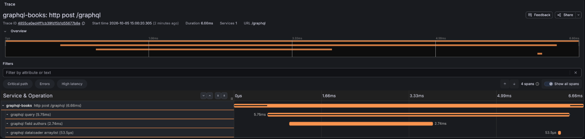
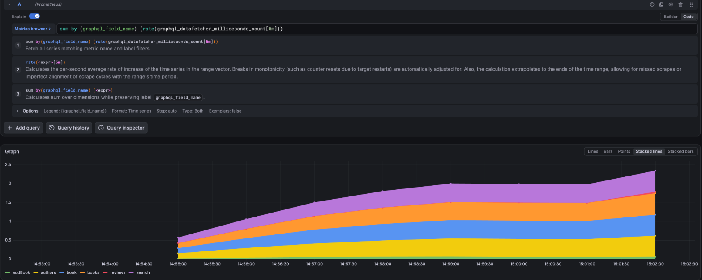
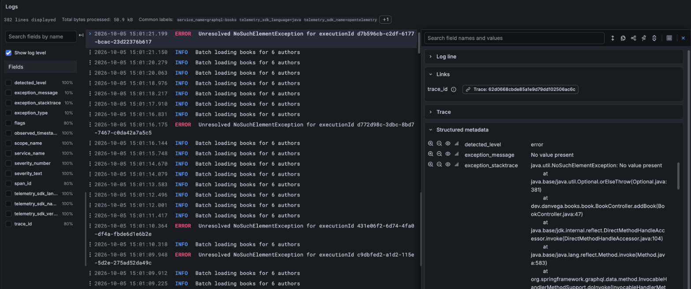
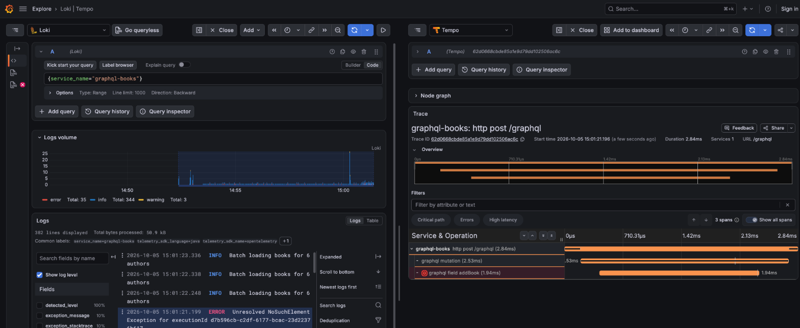

# GraphQL Books

A modern GraphQL API showcasing best practices for building scalable and efficient APIs using Spring Boot and GraphQL Java.

**Project Requirements**

* Java 27
* Maven 3.6+
* Docker and Docker Compose
* PostgreSQL 17+

**Key Features:**

* Schema-first GraphQL API design
* JPA entity relationships
* Batch loading optimization
* Query by Example filtering
* Virtual thread support
* GraphQL client implementation
* Observability integration

## Introduction

This project demonstrates how to build a GraphQL API using Spring Boot that manages a library of books, authors, and reviews. 
It showcases how GraphQL can solve common REST API challenges like overfetching, underfetching, and multiple endpoint calls 
while providing a flexible and efficient way to query data.

## Agenda

- [Why GraphQL](#why-graphql)   
- [Getting Started](#getting-started)
- [Schema First Approach](#schema-first-development)
- [Schema Mapping Inspection Report](#schema-mapping-inspection-report)
- [Data Fetchers](#data-fetchers)
- [Union (Search)](#unions)
- [Performance Improvements](#performance-improvements)
- [Data Integration](#data-integration)
- [Observability](#observability)
- [Client App](#client-app)
- [Federation](#federation)
- [Resources](#resources)
- [Conclusion](#conclusion)

### Branches

Each step of the agenda has its own branch. Every branch builds on the one before it, so you can check out any
step and run it. The `master` branch holds the finished code.

| Agenda Step | Branch |
|-------------|--------|
| Getting Started | `01-getting-started` |
| Schema First Approach | `02-schema-first` |
| Schema Mapping Inspection Report | `02-schema-first` |
| Data Fetchers | `03-data-fetchers` |
| Union (Search) | `04-unions` |
| Performance Improvements (the N+1 problem) | `05-n-plus-one` |
| Performance Improvements (batch loading) | `06-batch-mapping` |
| Data Integration | `07-data-integration` |
| Observability | `08-observability` |
| Client App | `09-client-app` |

```bash
git checkout 03-data-fetchers
./mvnw clean spring-boot:run
```

Always clean after you switch branches. From the terminal, run `./mvnw clean spring-boot:run`. In IntelliJ, use
**Build > Rebuild Project** before you run. Otherwise the last branch's classes and config stay in `target/`, and
files from a later branch can stop an earlier one from starting.

## Why GraphQL

- **No more over-fetching** — GraphQL lets clients request exactly the fields they need, so you never receive more data than your application actually uses.
- **Multiple resources in a single request** — Instead of hitting several REST endpoints, a single GraphQL query can fetch data from multiple resources in one round trip.
- **Avoid REST API explosion of endpoints** — GraphQL exposes a single endpoint that handles all queries and mutations, eliminating the sprawl of `/users`, `/users/{id}/posts`, `/users/{id}/orders`, etc.
- **Strongly-typed schema** — Every field, type, and relationship in your API is defined upfront in a schema, giving you a clear contract between client and server that's enforced at runtime.
- **Self-documenting** — The schema itself serves as living documentation, and tools like GraphiQL let developers explore the entire API surface without needing a separate doc site.
- **Developer tooling** — GraphQL's introspection feature powers rich tooling like GraphiQL, IDE autocompletion, and automatic client code generation out of the box.
- **Avoids API versioning** — You can add new fields and types to a GraphQL schema without breaking existing clients, removing the need for `/v1`, `/v2`, `/v3` endpoint versioning strategies.

## Getting Started

* Project setup with Spring Boot 4.1.1
* [Essential dependencies](https://start.spring.io/#!type=maven-project&language=java&platformVersion=4.1.1&packaging=jar&configurationFileFormat=yaml&jvmVersion=27&groupId=dev.danvega&artifactId=graphql-books&packageName=dev.danvega.books&dependencies=web,graphql,data-jpa,postgresql,actuator,devtools,docker-compose):
  * Spring WebMVC
  * Spring for GraphQL
  * Spring Data JPA
  * PostgreSQL
  * Actuator
  * DevTools
  * Docker Compose Support
* Review & Discuss
  * pom.xml (Current Versions of Spring for GraphQL 2.0.5 & GraphQL Java 25.0)
  * compose.yaml (Docker Compose configuration for local development)
  * application.yaml (Application configuration with GraphiQL UI enabled)
* Book Package
  * Book Class, Repository
* Author Package
  * Author Class, Repository
* Application / DataLoader

## Schema First Development

Unlike REST APIs where the contract is often determined by the implementation, GraphQL promotes a schema-first approach 
where we define our API contract before writing any code. This brings several key advantages:

1. Clear Contract: The schema serves as a single source of truth for both client and server teams
2. Design-Driven Development: Teams can agree on the API design before implementation begins
3. Type Safety: The strongly-typed schema ensures consistency across the entire API
4. Automatic Documentation: The schema is self-documenting and can generate API documentation
5. Better Tooling: IDEs and tools can provide better development experience with type information

### Schema Definition Language (SDL)

https://spec.graphql.org/October2021/

Our books API demonstrates core GraphQL schema concepts:

**Key Components:**

* Object Types & fields
  * Define the shape of your data
  * Properties marked with ! are non-nullable (type modifier)
  * Can reference other types (like Author in Book)
  * Object types are output types
* Scalar Types
  * Built-in: String, Int, Float, Boolean, ID
  * Can be extended with custom scalars
* Operation Types
  * Query
  * Mutation
  * Subscription
* Input Types
  * Special types for mutation arguments
  * Reusable across multiple mutations
* Interfaces, ENUMS, Unions

Create the object types Book & Author: 

```graphql
type Book {
    id: Int!
    title: String!
    author: Author!
}

type Author {
    id: ID!
    name: String!
    books: [Book!]!
}
```
Create a Book Query to return all the books in the system

```graphql
type Query {
    books: [Book!]!
}
```

## Schema Mapping Inspection Report

The Schema Mapping Report is a startup validation feature that ensures your Java implementation matches your GraphQL schema.

**Core Features:**

* Startup Validation
  * Verifies all GraphQL types have corresponding Java implementations
  * Checks for missing data fetchers
  * Reports any schema/code mismatches
* Data Fetcher Detection
  * Maps GraphQL fields to Spring controller methods
  * Recognizes @SchemaMapping, @QueryMapping, and @MutationMapping annotations 
* Smart Type Resolution 
  * Handles interfaces and unions 
  * Automatically discovers implementation types in same package

## Data Fetchers

* Spring's @SchemaMapping annotation usage
* Query resolvers with @QueryMapping
  * books, book
* Mutation resolvers with @MutationMapping
  * addBook
  * with variables first and then an input type
* GraphiQL interactive exploration

### GraphQL Query Examples

```graphql
# find all books
query {
  books {
    id
    title
  }
}

# find book with id of 1
query {
  book(id: 1) {
    id
    title
  }
}

# variables
query findBookById($id: Int!) {
  book(id: $id) {
    id
    title
    author {
      id
      name
    }
  }
}

# schema 
type Mutation {
    addBook(title: String!, authorId: Int!): Book!
}

# these are all output types
# what about input types
input BookInput {
    title: String!
    authorId: Int!
}

# query 
mutation {
  addBook(bookInput: {title:"new book", authorId:1}) {
    id
    title
  }
}
```

## Unions

* Implementation of the SearchItem union type
* Type resolution and polymorphic responses
* Search functionality across multiple types
* Dynamic result handling

```graphql
union SearchItem = Author | Book
```

```java
@Controller
public class SearchController {

    private static final Logger log = LoggerFactory.getLogger(SearchController.class);
    private final BookRepository bookRepository;
    private final AuthorRepository authorRepository;

    public SearchController(BookRepository bookRepository, AuthorRepository authorRepository) {
        this.bookRepository = bookRepository;
        this.authorRepository = authorRepository;
    }

    @QueryMapping
    List<Object> search(@Argument String text) {
        log.debug("Searching for '" + text + "'");
        List<Object> results = new ArrayList<>();
        results.addAll(authorRepository.findAllByNameContainsIgnoreCase(text));
        results.addAll(bookRepository.findAllByTitleContainsIgnoreCase(text));
        return results;
    }
}
```

## Performance Improvements

Both steps run the same query. Watch how long it takes and what shows up in the log.

```graphql
query {
  authors {
    name
    books {
      title
    }
  }
}
```

### The N+1 Problem

Branch: `05-n-plus-one`

* `AuthorController` loads each author's books with `@SchemaMapping`
* Spring for GraphQL calls that method once for every author: 1 query for the authors, then N more for their books
* A 1 second delay stands in for a slow database or service, so 6 authors take about 6 seconds
* The log shows one `Retrieving books for author` line per author
* All of this happens one call after another on the same Tomcat thread

### Batch Loading with @BatchMapping

Branch: `06-batch-mapping`

* `@BatchMapping` receives every author at once instead of one at a time
* One repository call (`findByAuthorIdIn`) loads all the books, then they're grouped by author
* The same query drops to about 0.1 seconds, and the log shows a single `Batch loading books for 6 authors` line
* Database optimization: `AuthorRepository.findAllWithBooks()` shows the JOIN FETCH alternative
* Leveraging Project Loom: uncomment `spring.threads.virtual.enabled` in `application.yaml` and Tomcat handles each request on a virtual thread


## Data Integration

### Query By Example and @GraphQLRepository 

When building APIs, one of the most common challenges developers face is implementing flexible search functionality.
You often need to support filtering based on multiple optional criteria, leading to complex query logic and verbose repository methods.
Spring Boot 3.2 introduces a powerful combination: GraphQL with Query by Example (QBE) support, offering an elegant solution to this challenge.

Traditional approaches to implementing dynamic queries often involve writing multiple repository methods or building complex predicates.
Consider a book management system where users need to search by title, author, or publication year in any combination.
Your repository might end up looking like this:

```java
public interface BookRepository extends JpaRepository<Book, Long> {
    List<Book> findByTitle(String title);
    List<Book> findByAuthor(String author);
    List<Book> findByPublishedYear(Integer year);
    List<Book> findByTitleAndAuthor(String title, String author);
    List<Book> findByTitleAndPublishedYear(String title, Integer year);
    List<Book> findByAuthorAndPublishedYear(String author, Integer year);
    List<Book> findByTitleAndAuthorAndPublishedYear(String title, String author, Integer year);
}
```

The magic happens with the `@GraphQLRepository` annotation, which automatically creates data fetchers for your GraphQL 
queries based on the repository methods. Combined with QueryByExampleExecutor, it enables dynamic querying without additional code.

```graphql
type Query {
  review(id: Int!): Review
  reviews(filter: ReviewFilter): [Review]!
}

type Review {
  id: ID!
  rating: Int!
  comment: String
  createdAt: String!
  reviewerName: String!
  verified: Boolean!
  book: Book!
}

input ReviewFilter {
  rating: Int
  verified: Boolean
  reviewerName: String
}
```

Example queries demonstrating the review filtering system:

```graphql

# Find verified reviews only
{
  reviews(filter: { verified: true }) {
    reviewerName
    rating
    comment
  }
}

# Find reviews by Sarah Chen
{
  reviews(filter: { reviewerName: "Sarah Chen" }) {
    book {
      title
    }
    reviewerName
    rating
    comment
  }
}
```

**Best Practices and Considerations**

When implementing GraphQL with Query by Example, keep these points in mind:

* Use nullable fields in your input types to make them optional for searching
* Consider adding match modes (exact, contains, starts with) for string fields
* Implement pagination for large result sets
* Add proper validation and error handling

https://www.danvega.dev/blog/spring-boot-graphql-query-by-example

### Spring Data AOT Repositories

Spring Boot 4 introduces Spring Data AOT (Ahead-of-Time) compilation, which moves repository query processing from
runtime to build time. Instead of parsing derived query method names and `@Query` annotations on every application
startup, the AOT processor pre-generates SQL statements and repository implementations during the build.

**Benefits:**

* **Faster startup** — eliminates runtime reflection and query parsing (50-70% improvement)
* **Build-time error detection** — catch typos in method names (e.g., `findByNamme`) before deployment
* **Lower memory usage** — pre-compiled implementations avoid reflection overhead
* **GraalVM ready** — all code paths are known at build time, enabling native image compilation
* **Inspectable** — view and debug generated implementations in `target/spring-aot/`

In this project, repositories like `BookRepository` and `AuthorRepository` already use derived query methods
(`findAllByTitleContainsIgnoreCase`, `findAllByNameContainsIgnoreCase`) and `@Query` annotations that get
pre-compiled by the AOT processor.

**Maven Setup:**

To enable AOT processing, add the `process-aot` goal to the `spring-boot-maven-plugin`:

```xml
<plugin>
    <groupId>org.springframework.boot</groupId>
    <artifactId>spring-boot-maven-plugin</artifactId>
    <executions>
        <execution>
            <id>process-aot</id>
            <goals>
                <goal>process-aot</goal>
            </goals>
        </execution>
    </executions>
</plugin>
```

```bash
# AOT processing happens during package
./mvnw clean package

# View generated code
ls target/spring-aot/main/sources/
```

**Resources:**

* [Spring Data AOT Repositories](https://www.danvega.dev/blog/spring-data-aot-repositories)
* [Video Tutorial](https://youtu.be/s_kmDbitE8s)
* [GitHub Example](https://github.com/danvega/spring-data-aot)
* [Official Documentation](https://docs.spring.io/spring-data/commons/reference/aot.html)

## Observability

Observability is the ability to observe the internal state of a running system from the outside. It consists of the 
three pillars logging, metrics and traces.

Spring projects now have their own, built-in instrumentation for metrics and traces based on the new Observation API from Micrometer

GraphQL is a good use case for Observability in general, as the GraphQL engine can fan out data fetching across REST APIs, data stores, caches, and more.

* Metrics collection using Micrometer
* Trace propagation across services
* GraphQL-specific instrumentation
* Performance monitoring and debugging

### OpenTelemetry Integration in Spring Boot 4

Spring Boot 4 introduces the official spring-boot-starter-opentelemetry for production-ready observability with automatic instrumentation of HTTP requests, GraphQL operations, and log correlation.

**Overview**

The new OpenTelemetry starter simplifies observability by providing automatic instrumentation out of the box.
Spring Boot internally uses Micrometer but exports all telemetry via OTLP (OpenTelemetry Protocol) to any
compatible backend like Grafana, Jaeger, or Zipkin.

**Key Concepts**

- **Single dependency**: `spring-boot-starter-opentelemetry` replaces complex setup
- **Automatic instrumentation**: HTTP server/client, GraphQL requests, data fetchers, and DataLoaders
- **No SQL spans by default**: JDBC queries are not traced out of the box. Add a library like `datasource-micrometer` if you want them.
- **Log correlation**: Automatic trace/span ID injection into logs
- **OTLP export**: Works with any OpenTelemetry-compatible backend
- **Production-ready**: Official Spring support. The starter itself has no alpha dependencies.

**Running It Locally**

The `compose.yaml` file starts the `grafana/otel-lgtm` container next to Postgres. It bundles an OpenTelemetry
collector with Grafana, Tempo (traces), Prometheus (metrics), and Loki (logs).

You don't need any OTLP endpoint configuration. Spring Boot's Docker Compose support finds the container and wires
the trace, metric, and log exporters for you. The only setting is the sampling rate in `application.yaml`:

```yaml
management:
  tracing:
    sampling:
      probability: 1.0
```

Run a few queries in GraphiQL, then open Grafana at [http://localhost:3000](http://localhost:3000). Go to
**Explore**, pick **Tempo**, and search for the `graphql-books` service. Each request shows the GraphQL spans:

* `http post /graphql`
* `graphql query`
* `graphql field authors`
* `graphql dataloader` (the batch loader at work)

Here is the trace for `{ authors { name books { title } } }`. The books for all six authors load in one
DataLoader call instead of one call per author.



Metrics are exported once a minute, so give them a moment to show up in Prometheus. Spring for GraphQL records
timers for requests, data fetchers, and DataLoaders. This query charts data fetcher calls per field:

```promql
sum by (graphql_field_name) (rate(graphql_datafetcher_milliseconds_count[5m]))
```



**Sending Logs to Grafana**

The starter exports traces and metrics. Logs need one more piece: the OpenTelemetry Logback appender. It's still
published as an alpha release, so pick the version built on the same OpenTelemetry SDK that Spring Boot uses.

```xml
<dependency>
    <groupId>io.opentelemetry.instrumentation</groupId>
    <artifactId>opentelemetry-logback-appender-1.0</artifactId>
    <version>2.28.1-alpha</version>
</dependency>
```

Two small files wire it up:

* `logback-spring.xml` adds the `OTEL` appender next to the console appender.
* `InstallOpenTelemetryAppender` hands Spring's `OpenTelemetry` bean to the appender at startup.

In Grafana, go to **Explore**, pick **Loki**, and filter on `service_name="graphql-books"`. Error logs include
the exception and its stack trace.



Each log line carries its trace ID. Click the trace link to open that request's trace next to the logs. Here,
an `addBook` call with an unknown author fails, and Tempo marks the failing span in red.



https://www.danvega.dev/blog/opentelemetry-spring-boot

https://github.com/danvega/ot

## Client App

Spring for GraphQL includes a built-in client that makes it easy to consume a GraphQL API from Java. The `ClientApp`
is a standalone Spring Boot application (`WebApplicationType.NONE`) that demonstrates how to call the GraphQL server
using Spring's native `HttpSyncGraphQlClient`.

**Key Concepts:**

* **`HttpSyncGraphQlClient`** — A synchronous GraphQL client built on top of `RestClient`, ideal for blocking applications
* **Standalone execution** — Runs as a non-web app via `SpringApplicationBuilder`, separate from the server
* **Document-based queries** — Define your GraphQL query as a string and pass variables with type-safe binding
* **Automatic deserialization** — Map the response directly to your entity class with `.toEntity(Book.class)`
* **Async alternative** — You can swap `.retrieveSync()` for `.retrieve()` to get reactive support (requires WebFlux on the classpath)

```java
var book = client.document(document)
        .variable("id", 1L)
        .retrieveSync("book")
        .toEntity(Book.class);
```

The client constructs an `HttpSyncGraphQlClient` from a `RestClient` pointed at `http://localhost:8080/graphql`,
sends a `findBookById` query with a variable, and deserializes the nested `book` field from the response into a `Book` entity —
including its related `Author`.

## Netflix DGS Integration

The Netflix Domain Graph Service (DGS) Framework is a GraphQL server framework for Java, built on top of Spring Boot.
In March 2024, the DGS Framework introduced an integration with Spring for GraphQL, aiming to unify the GraphQL Java community
and leverage the strengths of both frameworks.

https://docs.spring.io/spring-graphql/reference/codegen.html

## Federation

GraphQL Federation is an architectural pattern and specification that allows you to combine multiple GraphQL services into 
a single unified API. It's particularly useful for large organizations with multiple teams working on different 
parts of the API.

https://github.com/apollographql/federation-jvm-spring-example

## Resources

[Spring for GraphQL - Reference Documentation](https://docs.spring.io/spring-graphql/reference)
[Spring for GraphQL - GitHub](https://github.com/spring-projects/spring-graphql)
[Spring for GraphQL - GitHub Examples](https://github.com/spring-projects/spring-graphql-examples)
[GraphQL Playlist on YouTube](https://www.youtube.com/playlist?list=PLZV0a2jwt22u5DEFwYSzOM7mg6AjL90hw)
[Spring for GraphQL Java Book](https://leanpub.com/graphql-java/)

## Conclusion

This project demonstrates how GraphQL can provide a more efficient and flexible API compared to traditional REST approaches. 
Through features like precise data selection, batch loading, and strong typing, we've shown how to build a scalable and 
maintainable API that better serves both frontend and backend developers.